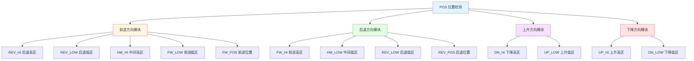

# POS 功能块分析报告

## 基本信息

| 项目 | 内容 |
|------|------|
| 功能块名称 | POS |
| 功能描述 | Position Detection（位置检测） |
| 最后修改 | 未标注 |
| 作者 | 未标注 |
| 页数 | 1页（12个程序段） |

## 功能概述

POS是一个位置检测功能块，用于检测运动部件的位置状态。该功能块支持前进、后退、上升、下降四个方向的位置检测，并通过限位开关信号判断当前位置区域。

### 应用场景
- **行车位置检测**：检测行车的运行位置
- **升降机控制**：检测升降机的位置状态
- **推钢机控制**：检测推钢机的位置
- **移动设备定位**：检测移动设备的位置区域

### 功能特点
1. **四方向检测**：支持前进、后退、上升、下降四个方向
2. **多区域判断**：判断高区、低区、位置到达等状态
3. **边沿触发**：使用R_TRIG检测方向信号变化
4. **状态记忆**：使用SET/RESET线圈记忆位置状态

## 思维导图

## 流程路径描述

### 前进方向路径：
开始 → FW_SIGN信号 → 检测各限位 → 设置位置状态
**功能**: 检测前进方向的位置状态

### 后退方向路径：
开始 → REV_SIGN信号 → 检测各限位 → 设置位置状态
**功能**: 检测后退方向的位置状态

### 上升方向路径：
开始 → UP_SIGN信号 → 检测各限位 → 设置位置状态
**功能**: 检测上升方向的位置状态

### 下降方向路径：
开始 → DN_SIGN信号 → 检测各限位 → 设置位置状态
**功能**: 检测下降方向的位置状态

## 逐帧功能分析

### Rung 1-3: 前进方向位置检测

**功能描述**: 检测前进方向的位置状态

**输入条件**:
| 信号名称 | 信号描述 | 信号类型 | 触发值 |
|----------|----------|----------|--------|
| FW_SIGN | 前进信号 | BOOL | 上升沿 |
| REV_SL_LMT | 后退慢速限位 | BOOL | TRUE |
| HM_SL_LMT | 中间慢速限位 | BOOL | TRUE |
| HM_ST_LMT | 中间停止限位 | BOOL | TRUE |
| FW_SL_LMT | 前进慢速限位 | BOOL | TRUE |

**输出功能**:
| 信号名称 | 信号描述 | 信号类型 |
|----------|----------|----------|
| REV_HI | 后退高区 | BOOL |
| REV_LOW | 后退低区 | BOOL |
| HM_HI | 中间高区 | BOOL |
| HM_LOW | 中间低区 | BOOL |
| FW_LOW | 前进低区 | BOOL |
| FW_HI | 前进高区 | BOOL |
| FW_POS | 前进位置 | BOOL |
| REV_POS | 后退位置 | BOOL |

**触发逻辑**:
- 前进时经过REV_SL_LMT → SET REV_HI, RESET REV_LOW
- 前进时经过HM_SL_LMT → SET HM_HI, RESET HM_LOW
- 前进时经过FW_SL_LMT → SET FW_LOW, RESET FW_HI
- 前进时经过HM_ST_LMT → SET FW_POS, RESET REV_POS

**功能实现**: 
使用R_TRIG检测FW_SIGN上升沿，结合限位开关信号，使用SETCOIL和RESETCOIL设置位置状态。

### Rung 4-7: 后退方向位置检测

**功能描述**: 检测后退方向的位置状态

**输入条件**:
| 信号名称 | 信号描述 | 信号类型 | 触发值 |
|----------|----------|----------|--------|
| REV_SIGN | 后退信号 | BOOL | 上升沿 |
| FW_SL_LMT | 前进慢速限位 | BOOL | TRUE |
| HM_SL_LMT | 中间慢速限位 | BOOL | TRUE |
| HM_ST_LMT | 中间停止限位 | BOOL | TRUE |
| REV_SL_LMT | 后退慢速限位 | BOOL | TRUE |

**输出功能**:
| 信号名称 | 信号描述 | 信号类型 |
|----------|----------|----------|
| FW_HI | 前进高区 | BOOL |
| FW_LOW | 前进低区 | BOOL |
| HM_LOW | 中间低区 | BOOL |
| HM_HI | 中间高区 | BOOL |
| REV_LOW | 后退低区 | BOOL |
| REV_HI | 后退高区 | BOOL |
| REV_POS | 后退位置 | BOOL |
| FW_POS | 前进位置 | BOOL |

**触发逻辑**:
- 后退时经过FW_SL_LMT → SET FW_HI, RESET FW_LOW
- 后退时经过HM_SL_LMT → SET HM_LOW, RESET HM_HI
- 后退时经过REV_SL_LMT → SET REV_LOW, RESET REV_HI
- 后退时经过HM_ST_LMT → SET REV_POS, RESET FW_POS

### Rung 8-9: 上升方向位置检测

**功能描述**: 检测上升方向的位置状态

**输入条件**:
| 信号名称 | 信号描述 | 信号类型 | 触发值 |
|----------|----------|----------|--------|
| UP_SIGN | 上升信号 | BOOL | 上升沿 |
| DN_SL_LMT | 下降慢速限位 | BOOL | TRUE |
| UP_SL_LMT | 上升慢速限位 | BOOL | TRUE |

**输出功能**:
| 信号名称 | 信号描述 | 信号类型 |
|----------|----------|----------|
| DN_HI | 下降高区 | BOOL |
| DN_LOW | 下降低区 | BOOL |
| UP_LOW | 上升低区 | BOOL |
| UP_HI | 上升高区 | BOOL |

**触发逻辑**:
- 上升时经过DN_SL_LMT → SET DN_HI, RESET DN_LOW
- 上升时经过UP_SL_LMT → SET UP_LOW, RESET UP_HI

### Rung 10-11: 下降方向位置检测

**功能描述**: 检测下降方向的位置状态

**输入条件**:
| 信号名称 | 信号描述 | 信号类型 | 触发值 |
|----------|----------|----------|--------|
| DN_SIGN | 下降信号 | BOOL | 上升沿 |
| UP_SL_LMT | 上升慢速限位 | BOOL | TRUE |
| DN_SL_LMT | 下降慢速限位 | BOOL | TRUE |

**输出功能**:
| 信号名称 | 信号描述 | 信号类型 |
|----------|----------|----------|
| UP_HI | 上升高区 | BOOL |
| UP_LOW | 上升低区 | BOOL |
| DN_LOW | 下降低区 | BOOL |
| DN_HI | 下降高区 | BOOL |

**触发逻辑**:
- 下降时经过UP_SL_LMT → SET UP_HI, RESET UP_LOW
- 下降时经过DN_SL_LMT → SET DN_LOW, RESET DN_HI

## 触发条件总结

### 前进方向触发
- **FW_SIGN上升沿**: 检测前进方向信号
- **限位开关**: REV_SL_LMT、HM_SL_LMT、HM_ST_LMT、FW_SL_LMT

### 后退方向触发
- **REV_SIGN上升沿**: 检测后退方向信号
- **限位开关**: FW_SL_LMT、HM_SL_LMT、HM_ST_LMT、REV_SL_LMT

### 上升方向触发
- **UP_SIGN上升沿**: 检测上升方向信号
- **限位开关**: DN_SL_LMT、UP_SL_LMT

### 下降方向触发
- **DN_SIGN上升沿**: 检测下降方向信号
- **限位开关**: UP_SL_LMT、DN_SL_LMT

## 实现功能总结

### 主要功能
1. **四方向检测**: 检测前进、后退、上升、下降四个方向
2. **区域判断**: 判断高区、低区位置状态
3. **位置到达**: 检测是否到达目标位置
4. **状态记忆**: 记忆当前位置状态

### 位置状态说明
| 状态 | 说明 |
|------|------|
| REV_HI | 后退高区（远离前进端） |
| REV_LOW | 后退低区（接近中间） |
| HM_HI | 中间高区 |
| HM_LOW | 中间低区 |
| FW_LOW | 前进低区（接近前进端） |
| FW_HI | 前进高区 |
| FW_POS | 前进位置到达 |
| REV_POS | 后退位置到达 |

## 关键信号说明

| 信号名称 | 信号描述 | 信号类型 | 用途 |
|----------|----------|----------|------|
| FW_SIGN | 前进信号 | BOOL | 前进方向触发 |
| REV_SIGN | 后退信号 | BOOL | 后退方向触发 |
| UP_SIGN | 上升信号 | BOOL | 上升方向触发 |
| DN_SIGN | 下降信号 | BOOL | 下降方向触发 |
| REV_SL_LMT | 后退慢速限位 | BOOL | 限位开关 |
| HM_SL_LMT | 中间慢速限位 | BOOL | 限位开关 |
| HM_ST_LMT | 中间停止限位 | BOOL | 限位开关 |
| FW_SL_LMT | 前进慢速限位 | BOOL | 限位开关 |
| UP_SL_LMT | 上升慢速限位 | BOOL | 限位开关 |
| DN_SL_LMT | 下降慢速限位 | BOOL | 限位开关 |
| *_HI/*_LOW | 位置区域 | BOOL | 位置状态输出 |
| *_POS | 位置到达 | BOOL | 位置到达输出 |

## 调试技巧

### 调试步骤
1. 检查各限位开关信号是否正常
2. 验证方向信号是否正确
3. 测试各位置状态是否正确切换
4. 检查SET/RESET逻辑是否正确

### 常见问题
1. **位置状态不切换**: 检查限位开关和方向信号
2. **状态错误**: 检查SET/RESET逻辑
3. **方向判断错误**: 检查方向信号设置

### 监控信号列表
- FW_SIGN/REV_SIGN（方向信号）
- 各限位开关信号
- *_HI/*_LOW（位置区域状态）
- FW_POS/REV_POS（位置到达状态）
