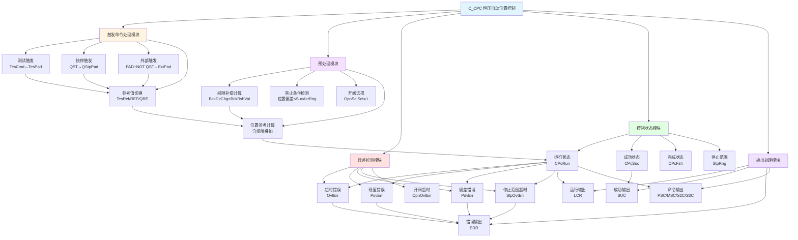

# C_CPC 功能块分析报告

## 基本信息
| 项目 | 内容 |
|------|------|
| 功能块名称 | C_CPC |
| 功能描述 | Constant Voltage Automatic Position Control（恒压自动位置控制） |
| 最后修改 | 2015.12.29 |
| 作者 | ShiChunLiang |
| 页数 | 1页 |

## 功能概述

C_CPC是一个**恒压自动位置控制（CPC）**功能块，用于实现需要恒定压力控制的位置调节系统。该功能块在标准位置控制基础上增加了开阀选择、间隙补偿、连续控制等高级功能，适用于液压系统、压力容器等需要精确压力控制的应用场景。

### 核心功能
- **多模式触发**：测试模式、快停模式、外部触发模式
- **间隙补偿**：自动计算和补偿机械间隙（Backrush）
- **开阀选择**：特定条件下选择开阀控制
- **连续控制**：支持连续控制模式
- **多级错误检测**：超时、现值错误、偏差错误、停止范围超时、开阀超时
- **多速度段控制**：支持高速、中速、低速多段控制

## 思维导图



## 流程路径描述

### 主流程路径
```
触发命令 → 参考值切换 → 预处理（间隙补偿） → 运行联锁检测 → [条件满足] → 运行 → 状态检测 → 输出
                                                            ↓
                                                        [条件不满足] → 等待
```

### 预处理流程路径
```
CPcPad有效 → 间隙计算 → 间隙检测 → 位置参考计算 → 预处理完成
     ↓
CPcPad无效 → 跳转PrepEnd → 直接进入控制阶段
```

### 错误检测流程
```
运行中 → 超时检测 → 现值范围检测 → 偏差检测 → 停止范围检测 → 开阀检测
           ↓              ↓              ↓              ↓           ↓
        OvtErr        PsvErr         PdvErr        StpOvtErr    OpnOvtErr
           ↓              ↓              ↓              ↓           ↓
                        任一错误 → ERR输出 → 停止运行
```

## 逐帧功能分析

### 第1-9帧：头部信息
```
COMMENT /* Function Name:     C_CPC */;
COMMENT /* Last Modified:        2015.12.29 */;
COMMENT /* Author:                     ShiChunLiang */;
COMMENT /* Description:            Constant Voltage Automatic Position Control(CPC) */;
```
定义功能块基本信息，CPC为恒压自动位置控制。

### 第13-15帧：输入数据限幅与转换
```
H_WIRE; INT_TO_REAL SCN **; DIV_REAL ** 1000.0 **; 
H_WIRE; CALL C_LIMR ** 0.15 0.001 Ts ** **; END_RUNG;
```
**功能说明**：
- 将扫描周期SCN转换为秒单位
- 限制Ts在0.001~0.15秒范围内
- 确保采样周期合理

### 第17-23帧：触发命令处理
```
H_WIRE; R_TRIG REM1 ** **; R+; NOCON TesCmd; ... COIL TesPad; END_RUNG;
H_WIRE; R_TRIG REM2 ** **; R+; NOCON QST; ... COIL QStpPad; END_RUNG;
NOCON PAD; NCCON QST; ... COIL ExtPad; END_RUNG;
```
**功能说明**：
- **TesPad**：测试触发，TesCmd上升沿触发
- **QStpPad**：快停触发，QST上升沿触发
- **ExtPad**：外部触发，PAD有效且QST无效
- 三种触发方式互斥，优先级：快停 > 测试 > 外部

### 第25-31帧：位置参考切换
```
NOCON TesPad; MOVE_REAL 1 TesRef PosRef; ... COIL CPcPad;
NOCON ExtPad; MOVE_REAL 1 REF PosRef;
NOCON QStpPad; MOVE_REAL 1 QRE PosRef;
```
**功能说明**：
- 根据触发模式选择位置参考：
  - 测试模式：**PosRef = TesRef**
  - 外部模式：**PosRef = REF**
  - 快停模式：**PosRef = QRE**
- **CPcPad**：CPC运行触发信号

### 第33-35帧：间隙状态检测
```
NOCON CPcPad; MUL_REAL UDT.BckDirChg UDT.BckRshVal **; 
ABS_REAL ** **; CMP_REAL ** 0.0 ** ** **; 
... MOVE_BOOL 1 #ALW_OFF,G,%S00008 BckRshON; 
... MOVE_BOOL 1 #ALW_ON,G,%S00007 BckRshON; END_RUNG;
```
**功能说明**：
- 计算间隙值：**BckRsh = |BckDirChg × BckRshVal|**
- BckDirChg：间隙方向系数（±1）
- BckRshVal：间隙值大小
- **BckRshON**：间隙补偿启用标志
- 当间隙值不为0时启用补偿

### 第37-39帧：禁止条件检测
```
H_WIRE; SUB_REAL PosRef FBK **; 
ABS_REAL ** **; 
LE_REAL ** UDT.SucAcrRng **; 
... EQ_INT UDT.InhSucRng 1 **; 
... NCCON CPcRun; NCCON BckRshON; COIL CPcInh; END_RUNG;
```
**功能说明**：
- 计算位置偏差绝对值
- **CPcInh** = (|PosRef - FBK| ≤ SucAcrRng) AND (InhSucRng = 1) AND NOT CPcRun AND NOT BckRshON
- 当偏差在精度范围内且启用禁止功能时，暂停控制
- 避免在精度范围内反复调整

### 第41-43帧：开阀选择检测
```
H_WIRE; SUB_REAL UDT.OpnLimVal UDT.OpnAdjVal **; 
LE_REAL ** PosRef **; 
EQ_INT UDT.OpnSelSet 1 **; 
... NCCON CPcInh; COIL CPcOpnSel; END_RUNG;
```
**功能说明**：
- 检测是否需要开阀选择
- **CPcOpnSel** = (OpnLimVal - OpnAdjVal ≤ PosRef) AND (OpnSelSet = 1) AND NOT CPcInh
- OpnLimVal：开阀限制值
- OpnAdjVal：开阀调整值
- OpnSelSet：开阀选择设置

### 第45-47帧：开阀限制检测
```
H_WIRE; SUB_REAL UDT.OpnLimVal UDT.OpnAdjVal **; 
LE_REAL ** FBK **; ... COIL OpnLimDet; END_RUNG;
```
**功能说明**：
- 检测是否已达到开阀限制
- **OpnLimDet** = (OpnLimVal - OpnAdjVal ≤ FBK)
- 用于开阀命令的联锁条件

### 第49-51帧：开阀命令与超时检测
```
H_WIRE; C_ODT TMR5 ** UDT.ErrDtTm[4] SCN **; 
... COIL OpnOvtErr; 
... COIL OpnCmd; END_RUNG;
```
**功能说明**：
- 调用C_ODT延时定时器检测开阀超时
- **OpnOvtErr**：开阀超时错误
- **OpnCmd**：开阀命令
- 开阀条件：CPcPad + OSI + AUX + ORI + CPcOpnSel + NOT OpnLimDet + NOT OpnOvtErr

### 第53-55帧：关闭方向检测
```
H_WIRE; GE_REAL FBK PosRef **; ... COIL ClsDirDet; END_RUNG;
```
**功能说明**：
- 检测运动方向
- **ClsDirDet** = (FBK ≥ PosRef)
- 用于确定关闭方向联锁

### 第57-59帧：运行联锁条件
```
NOCON CSI; NOCON ClsDirDet; NOCON CRI; NOCON ClsDirDet; NOCON AUX; 
NCCON CPcOpnSel; ... COIL CPcRIL; END_RUNG;
```
**功能说明**：
- 运行联锁条件计算：
  - 关闭方向：CSI × ClsDirDet + CRI × ClsDirDet
  - 开启方向：OSI × NOT ClsDirDet + ORI × NOT ClsDirDet
- **CPcRIL**：运行联锁满足标志

### 第61-67帧：运行状态控制
```
NOCON CPcPad; NCCON CPcInh; ... COIL PasAdv; END_RUNG;
NOCON PasAdv; NOCON CPcRIL; ... COIL CPcRun; END_RUNG;
```
**功能说明**：
- **PasAdv** = CPcPad AND NOT CPcInh（通过/前进条件）
- **CPcRun** = PasAdv AND CPcRIL（运行状态，自保持）
- 运行需要触发信号和联锁条件同时满足

### 第69-91帧：预处理序列
当PasAdv无效时跳转到PrepEnd，否则执行预处理：

#### 状态复位
```
NOCON PasAdv; MOVE_BOOL 1 #ALW_OFF CPcSuc; 
MOVE_BOOL 1 #ALW_OFF CPcFsh; 
MOVE_BOOL 1 #ALW_OFF StpRng; END_RUNG;
```
复位成功、完成、停止范围状态。

#### 间隙计算与检测
```
H_WIRE; MUL_REAL UDT.BckDirChg UDT.BckRshVal BckRsh; 
NE_REAL BckRsh 0.0 **; ... COIL BckRshON; END_RUNG;
```
计算间隙值并检测是否启用。

#### 重试间隙处理
```
H_WIRE; EQ_INT UDT.CpcRetry 0 **; NOCON BckRshON; ... COIL RtyBckRsh; END_RUNG;
```
当CpcRetry=0且间隙启用时，执行间隙重试。

#### 位置参考计算（含间隙）
```
H_WIRE; CALL C_NSWR 0.0 BckRsh ** ** PosRef **; 
ADD_REAL ** PosRef CPcPosRef; END_RUNG;
```
**CPcPosRef = PosRef + BckRsh**（含间隙补偿的位置参考）

### 第93帧：PrepEnd标签
```
LABELN PrepEnd; END_RUNG;
```
预处理结束标签。

### 第95-123帧：错误检测

#### 超时错误
```
H_WIRE; C_ODT TMR1 ** UDT.ErrDtTm[0] SCN **; 
NOCON CPcRun; NCCON PasAdv; ... COIL OvtErr; END_RUNG;
```
运行超时检测，ErrDtTm[0]为超时时间。

#### 现值错误
```
H_WIRE; LE_REAL FBK UDT.MaxStkSet **; 
GE_REAL FBK UDT.MinStkSet **; ... COIL InCtlRng; END_RUNG;
NCCON InCtlRng; NOCON CPcRun; ... COIL PsvErr; END_RUNG;
H_WIRE; C_ODT TMR2 ** UDT.ErrDtTm[1] SCN **; 
NOCON PsvErr; NCCON PasAdv; ... COIL PsvErrCont; END_RUNG;
```
- **InCtlRng**：现值在控制范围内（MinStkSet ≤ FBK ≤ MaxStkSet）
- **PsvErr**：现值错误（不在控制范围内）
- **PsvErrCont**：现值错误持续

#### 偏差错误
```
H_WIRE; SUB_REAL FBK PosFbkPrv **; 
ABS_REAL ** **; 
DIV_REAL ** Ts AbsSpdDet; 
MOVE_REAL 1 FBK PosFbkPrv; END_RUNG;
H_WIRE; GT_REAL AbsSpdDet UDT.TraMaxDev **; 
NOCON CPcRun; ... COIL PdvErr; END_RUNG;
H_WIRE; C_ODT TMR3 ** UDT.ErrDtTm[2] SCN **; 
NOCON PdvErr; NCCON PasAdv; ... COIL PdvErrCont; END_RUNG;
```
- 计算绝对速度：**AbsSpdDet = |FBK - PosFbkPrv| / Ts**
- **PdvErr**：偏差错误（速度超过TraMaxDev）
- **PdvErrCont**：偏差错误持续

#### 停止范围超时
```
H_WIRE; C_ODT TMR4 ** UDT.ErrDtTm[3] SCN **; 
NOCON CPcRun; NOCON StpRng; NCCON PasAdv; ... COIL StpOvtErr; END_RUNG;
```
在停止范围内停留超时。

### 第121-147帧：控制状态检测

#### OK状态
```
NCCON OvtErr; NCCON PsvErrCont; NCCON PdvErr; ... COIL CPcOK; END_RUNG;
```
**CPcOK** = NOT OvtErr AND NOT PsvErrCont AND NOT PdvErr

#### 间隙叠加
```
H_WIRE; SUB_REAL CPcPosRef FBK **; 
MUL_REAL ** UDT.BckDirChg **; 
GT_REAL ** 0.0 **; 
... COIL BckRshSup; END_RUNG;
```
检测是否需要间隙叠加补偿。

#### 位置偏差计算
```
H_WIRE; SUB_REAL CPcPosRef FBK PosDev; 
ABS_REAL PosDev AbsPosDev; END_RUNG;
```
计算位置偏差及其绝对值。

#### 控制状态
```
H_WIRE; GT_REAL PosDev 0.0 **; ... COIL DevPlus; END_RUNG;
H_WIRE; LT_REAL AbsPosDev UDT.SucAcrRng **; ... COIL CPcFsh; END_RUNG;
H_WIRE; LT_REAL AbsPosDev UDT.StpRng **; ... COIL StpRng; END_RUNG;
H_WIRE; GT_REAL AbsPosDev UDT.MiddSpdSet **; ... COIL Nch2RngDet; END_RUNG;
H_WIRE; GT_REAL AbsPosDev UDT.HighSpdSet **; ... COIL Nch3RngDet; END_RUNG;
```
- **DevPlus**：偏差为正（需要正向运动）
- **CPcFsh**：完成（偏差在精度范围内）
- **StpRng**：停止范围（偏差在停止范围内）
- **Nch2RngDet**：中速段检测
- **Nch3RngDet**：高速段检测

#### 成功检测
```
H_WIRE; C_ODT TMR6 ** UDT.SucDetTm SCN **; 
NOCON CPcFsh; NOCON StpRng; NOCON CPcRun; NCCON PasAdv; ... COIL CPcSuc; END_RUNG;
```
在完成状态持续SucDetTm时间后，确认成功。

### 第149-185帧：输出处理

#### 运行状态复位
```
NOCON OvtErr; MOVE_BOOL 1 #ALW_OFF CPcRun; END_RUNG;
```
错误发生时复位运行状态。

#### 输出信号
- **LCR**：运行中
- **SUC**：成功
- **CPcErr[000-004]**：各类错误（RS触发器记忆）
- **ERR**：错误综合输出

#### 低压推运行状态
```
H_WIRE; R_TRIG REM3 ** **; 
NOCON LPST; NOCON CSI; NOCON CRI; NOCON AUX; NOCON LPIL; 
NCCON QST; NCCON LCR; ... COIL LPR; END_RUNG;
```
低压推功能，用于特定工况下的压力控制。

#### 命令输出
```
NOCON CPcRun; NCCON StpRng; NOCON DevPlus; ... COIL PSC; END_RUNG;
NOCON CPcRun; NCCON StpRng; NCCON DevPlus; ... COIL MSC; END_RUNG;
NOCON CPcRun; NCCON StpRng; NOCON Nch2RngDet; ... COIL S2C; END_RUNG;
NOCON CPcRun; NCCON StpRng; NOCON Nch3RngDet; ... COIL S3C; END_RUNG;
```
- **PSC**：正向慢速命令
- **MSC**：反向慢速命令
- **S2C**：中速命令
- **S3C**：高速命令

## 触发条件总结

| 触发信号 | 触发条件 | 触发动作 |
|----------|----------|----------|
| TesCmd | 上升沿 | 进入测试模式 |
| QST | 上升沿 | 进入快停模式 |
| PAD | ON（QST为OFF） | 进入正常模式 |
| CPcInh | ON | 暂停控制（精度范围内） |
| OpnLimDet | ON | 开阀限制到达 |
| SUC | ON | 复位错误状态 |

## 实现功能总结

### 主要功能
1. **恒压位置控制**：实现精确的压力-位置控制
2. **间隙补偿**：自动补偿机械间隙
3. **多模式触发**：测试、快停、外部三种模式
4. **多速度段控制**：高速、中速、慢速三段控制
5. **开阀选择**：特定条件下选择开阀控制
6. **全面错误检测**：5种错误类型检测

### 速度段划分
```
|AbsPosDev| > HighSpdSet → 高速（S3C）
|AbsPosDev| > MiddSpdSet → 中速（S2C）
|AbsPosDev| ≤ MiddSpdSet → 慢速（PSC/MSC）
|AbsPosDev| ≤ StpRng → 停止范围
|AbsPosDev| ≤ SucAcrRng → 完成
```

### 错误类型
| 错误代码 | 错误类型 | 说明 |
|----------|----------|------|
| CPcErr[000] | 超时错误 | 运行时间超过设定值 |
| CPcErr[001] | 现值错误 | 位置反馈超出有效范围 |
| CPcErr[002] | 偏差错误 | 位置偏差变化异常 |
| CPcErr[003] | 停止超时 | 在停止范围内停留超时 |
| CPcErr[004] | 开阀超时 | 开阀动作超时 |

## 关键信号说明

| 信号名称 | 数据类型 | 方向 | 说明 |
|----------|----------|------|------|
| TesCmd/QST/PAD | BOOL | 输入 | 触发命令 |
| TesRef/REF/QRE | REAL | 输入 | 位置参考值 |
| FBK | REAL | 输入 | 位置反馈值 |
| UDT | STRUCT | 输入 | 参数结构体 |
| CSI/CRI/OSI/ORI | BOOL | 输入 | 联锁信号 |
| LCR | BOOL | 输出 | 运行中状态 |
| SUC | BOOL | 输出 | 成功状态 |
| ERR | BOOL | 输出 | 错误状态 |
| PSC/MSC/S2C/S3C | BOOL | 输出 | 速度命令 |
| OpnCmd | BOOL | 输出 | 开阀命令 |

## 调试技巧

### 参数整定
1. **精度范围（SucAcrRng）**：根据控制精度要求设置
2. **停止范围（StpRng）**：通常为精度范围的2-3倍
3. **速度切换点**：HighSpdSet > MiddSpdSet > StpRng
4. **错误检测时间**：根据执行机构响应特性设置

### 常见问题排查
| 问题现象 | 可能原因 | 解决方法 |
|----------|----------|----------|
| 频繁超时 | 执行机构慢 | 增加ErrDtTm参数 |
| 位置振荡 | 间隙设置不当 | 调整BckRshVal参数 |
| 开阀失败 | OpnLimVal设置错误 | 检查开阀限制参数 |
| 速度切换异常 | 速度切换点设置不当 | 调整HighSpdSet/MiddSpdSet |

### 在线监测建议
- 监控PosRef和FBK的差值变化
- 观察各速度段的切换过程
- 检查间隙补偿是否正常工作
- 验证各错误检测的正确性
