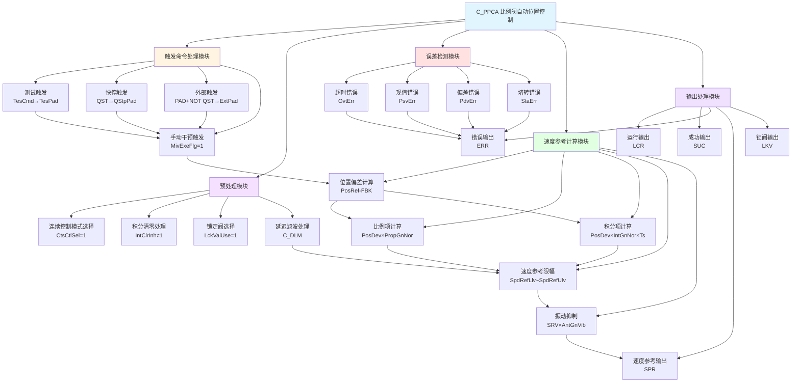

# C_PPCA 功能块分析报告

## 基本信息
| 项目 | 内容 |
|------|------|
| 功能块名称 | C_PPCA |
| 功能描述 | Proportional Valve Automatic Position Control（比例阀自动位置控制） |
| 最后修改 | 2015.12.02 |
| 作者 | ShiChunLiang |
| 页数 | 1页 |

## 功能概述

C_PPCA是一个**比例阀自动位置控制（PPC）**功能块，用于实现高精度的比例阀位置控制系统。该功能块采用PI控制算法，结合速度参考计算、振动抑制、积分控制等多种控制策略，实现对比例阀执行机构的精确控制。适用于液压比例阀、伺服阀等需要精确位置控制的场合。

### 核心功能
- **多模式触发**：测试模式、快停模式、外部触发模式、手动干预后自动模式
- **PI控制算法**：比例+积分控制，消除稳态误差
- **速度参考计算**：根据位置偏差计算速度参考值
- **振动抑制控制**：减少系统振动，提高控制稳定性
- **连续控制模式**：支持连续控制，适应不同工况
- **锁阀控制**：在特定条件下锁定阀门位置
- **多级错误检测**：超时、现值错误、偏差错误、堵转错误

## 思维导图



## 流程路径描述

### 主流程路径
```
触发命令 → 参考值切换 → 预处理 → 运行联锁检测 → [条件满足] → 运行 → PI计算 → 速度参考输出
                                                        ↓
                                                    [条件不满足] → 等待
```

### 预处理流程路径
```
PPcPad有效 → 连续控制模式检测 → [CtsCtlSel=1] → 连续控制预处理
                ↓
            [CtsCtlSel=0] → 非连续控制预处理 → 延迟滤波
```

### 速度参考计算流程
```
位置偏差 → 比例项计算 → 积分项计算 → 正常速度参考 → 加减速处理 → 振动抑制叠加 → 最终速度参考
```

## 逐帧功能分析

### 第1-9帧：头部信息
```
COMMENT /* Function Name:     C_PPCA */;
COMMENT /* Last Modified:        2015.12.02 */;
COMMENT /* Author:                     ShiChunLiang */;
COMMENT /* Description:            Proportional Valve Automatic Position Control(PPC) */;
```
定义功能块基本信息，PPC为比例阀自动位置控制。

### 第13-15帧：输入数据限幅与转换
```
H_WIRE; INT_TO_REAL SCN **; DIV_REAL ** 1000.0 **; 
H_WIRE; CALL C_LIMR ** 0.15 0.001 Ts ** **; END_RUNG;
```
**功能说明**：
- 将扫描周期SCN转换为秒单位
- 限制Ts在0.001~0.15秒范围内
- 确保采样周期合理

### 第17-31帧：触发命令处理

#### 测试触发
```
H_WIRE; R_TRIG REM1 ** **; R+; NOCON TesCmd; ... COIL TesPad; END_RUNG;
```
测试模式触发。

#### 快停触发
```
H_WIRE; R_TRIG REM2 ** **; R+; NOCON QST; ... COIL QStpPad; END_RUNG;
```
快停模式触发。

#### 外部触发
```
NOCON PAD; NCCON QST; ... COIL ExtPad; END_RUNG;
```
外部触发，PAD有效且QST无效。

#### 手动干预后自动触发
```
H_WIRE; C_ODT TMR0 ** 1000 SCN **; 
R_TRIG REM3 ** **; 
EQ_INT UDT.MivExeFlg 1 **; 
... COIL ManPad; END_RUNG;
```
**功能说明**：
- 当MivExeFlg=1时，检测手动干预后的自动触发
- 使用1秒延时定时器确保稳定
- **ManPad**：手动干预后自动模式触发
- 此时位置参考取当前反馈值FBK

### 第33-35帧：位置参考切换
```
NOCON TesPad; MOVE_REAL 1 TesRef PosRef; ... COIL PPcPad;
NOCON ManPad; MOVE_REAL 1 FBK PosRef;
NOCON ExtPad; MOVE_REAL 1 REF PosRef;
NOCON QStpPad; MOVE_REAL 1 QRE PosRef;
```
**功能说明**：
- 根据触发模式选择位置参考：
  - 测试模式：**PosRef = TesRef**
  - 手动干预模式：**PosRef = FBK**（当前反馈）
  - 外部模式：**PosRef = REF**
  - 快停模式：**PosRef = QRE**
- **PPcPad**：PPC运行触发信号

### 第37-41帧：运行联锁条件
```
H_WIRE; GE_REAL FBK PosRef **; ... COIL ClsDirDet; END_RUNG;
NOCON CSI; NOCON ClsDirDet; NOCON CRI; NOCON ClsDirDet; NOCON AUX; 
... COIL PPcRIL; END_RUNG;
```
**功能说明**：
- **ClsDirDet** = (FBK ≥ PosRef)：关闭方向检测
- 运行联锁条件：
  - 关闭方向：CSI × ClsDirDet + CRI × ClsDirDet
  - 开启方向：OSI × NOT ClsDirDet + ORI × NOT ClsDirDet
- **PPcRIL**：运行联锁满足标志

### 第43-45帧：禁止条件检测
```
H_WIRE; SUB_REAL PosRef FBK **; 
ABS_REAL ** **; 
LE_REAL ** UDT.SucAcrRng **; 
EQ_INT UDT.InhSucRng 1 **; 
... NCCON PPcRun; COIL PPcInh; END_RUNG;
```
**功能说明**：
- **PPcInh** = (|PosRef - FBK| ≤ SucAcrRng) AND (InhSucRng = 1) AND NOT PPcRun
- 当偏差在精度范围内且启用禁止功能时，暂停控制

### 第47-49帧：运行状态控制
```
NOCON PPcPad; NOCON PPcRIL; ... COIL PPcRun; END_RUNG;
```
**PPcRun** = PPcPad AND PPcRIL（自保持）

### 第51-77帧：预处理模块

#### 跳转条件
```
NCCON PPcPad; ... JUMPN PrepEnd; END_RUNG;
```
当PPcPad无效时跳转到PrepEnd。

#### 执行标志与锁定阀选择
```
H_WIRE; EQ_INT UDT.MivExeFlg 1 **; ... COIL ExeFlg; END_RUNG;
H_WIRE; EQ_INT UDT.LckValUse 1 **; ... COIL LckValSel; END_RUNG;
```
- **ExeFlg**：执行标志（手动干预模式）
- **LckValSel**：锁定阀选择标志

#### 连续控制模式检测
```
H_WIRE; EQ_INT UDT.CtsCtlSel 1 **; ... JUMPN PrepMd1; END_RUNG;
```
当CtsCtlSel=1时跳转到PrepMd1（连续控制模式）。

#### 非连续控制模式（PrepMd0）
```
H_WIRE; MOVE_REAL 1 0 IRN; MOVE_REAL 1 0 IRV; CONTCOIL; END_RUNG;
CONTCON; C_DLM DLM1 #ALW_OFF FBK ** ** ** ** ** **; 
C_DLM DLM2 #ALW_OFF SRP ** ** ** ** ** **; 
JUMPN PrepEnd; END_RUNG;
```
**功能说明**：
- 积分项IRN、IRV清零
- 调用C_DLM延迟滤波处理FBK和SRP
- 非连续模式下进行延迟滤波

#### 连续控制模式（PrepMd1）
```
LABELN PrepMd1; END_RUNG;
H_WIRE; NE_INT UDT.IntClrInh 1 **; 
MOVE_REAL 1 0 IRN; MOVE_REAL 1 0 IRV; COIL IntClrOn; END_RUNG;
H_WIRE; C_DLM DLM2 #ALW_OFF SRP ** ** ** ** ** **; 
NOCON IntClrOn; C_DLM DLM1 #ALW_OFF FBK ** ** ** ** ** **; END_RUNG;
```
**功能说明**：
- 当IntClrInh≠1时，清零积分项
- **IntClrOn**：积分清零标志
- 连续模式下对SRP和FBK进行延迟滤波

### 第77帧：PrepEnd标签
```
LABELN PrepEnd; END_RUNG;
```
预处理结束标签。

### 第79-109帧：错误检测模块

#### 超时错误
```
H_WIRE; C_ODT TMR1 ** UDT.ErrDtTm[0] SCN **; 
NOCON PPcRun; NCCON ExeFlg; NCCON PPcPad; ... COIL OvtErr; END_RUNG;
```
运行超时检测。

#### 现值错误
```
H_WIRE; GE_REAL FBK UDT.MinStkSet **; 
LE_REAL FBK UDT.MaxStkSet **; ... COIL InCtlRng; END_RUNG;
NCCON InCtlRng; NOCON PPcRun; ... COIL PsvErr; END_RUNG;
H_WIRE; C_ODT TMR2 ** UDT.ErrDtTm[1] SCN **; 
NOCON PsvErr; NCCON PPcPad; NCCON ExeFlg; ... COIL PsvErrCont; END_RUNG;
```
- **InCtlRng**：现值在控制范围内
- **PsvErr**：现值错误
- **PsvErrCont**：现值错误持续

#### 偏差错误
```
H_WIRE; SUB_REAL FBK PosFbkPrv **; 
ABS_REAL ** **; DIV_REAL ** Ts AbsSpdDet; 
MOVE_REAL 1 FBK PosFbkPrv; END_RUNG;
H_WIRE; GT_REAL AbsSpdDet UDT.TraMaxDev **; 
NOCON PPcRun; NCCON ExeFlg; ... COIL PdvErr; END_RUNG;
H_WIRE; C_ODT TMR3 ** UDT.ErrDtTm[2] SCN **; 
NOCON PdvErr; NCCON PPcPad; ... COIL PdvErrCont; END_RUNG;
```
- 计算绝对速度：**AbsSpdDet = |FBK - PosFbkPrv| / Ts**
- **PdvErr**：偏差错误
- **PdvErrCont**：偏差错误持续

#### 堵转错误
```
H_WIRE; ABS_REAL SPR AbsSpdRef; 
LT_REAL UDT.StaDetSpd AbsSpdRef **; ... COIL StaErr; END_RUNG;
H_WIRE; MUL_REAL AbsSpdRef UDT.StaDetRat **; 
GE_REAL ** AbsSpdDet **; 
C_ODT TMR4 ** UDT.ErrDtTm[3] SCN **; 
NOCON StaErr; NOCON PPcRun; NCCON ExeFlg; NCCON PPcPad; 
... COIL StaErrCont; END_RUNG;
```
**功能说明**：
- **StaErr** = (AbsSpdRef < StaDetSpd)：速度参考过低
- 堵转检测：AbsSpdRef × StaDetRat ≥ AbsSpdDet
- **StaErrCont**：堵转错误持续

#### OK状态
```
NCCON OvtErr; NCCON PsvErr; NCCON PdvErr; NCCON StaErrCont; 
... COIL PPcOK; END_RUNG;
```
**PPcOK** = NOT OvtErr AND NOT PsvErr AND NOT PdvErr AND NOT StaErrCont

### 第111-119帧：位置偏差计算与成功检测

#### 位置偏差计算
```
H_WIRE; SUB_REAL PosRef FBK **; 
NOCON PPcOK; MOVE_REAL 1 ** PosDev; END_RUNG;
```
**PosDev = PosRef - FBK**（PPcOK时更新）

#### 成功状态检测
```
H_WIRE; SUB_REAL PosRef FBK **; 
ABS_REAL ** **; 
LE_REAL ** UDT.SucAcrRng **; 
... COIL PPcFsh; END_RUNG;
H_WIRE; C_ODT TMR5 ** UDT.SucDetTm SCN **; 
NOCON PPcFsh; NOCON PPcRun; NCCON PPcPad; ... COIL PPcSuc; END_RUNG;
```
- **PPcFsh** = (|PosRef - FBK| ≤ SucAcrRng)：完成状态
- **PPcSuc**：成功状态（完成持续SucDetTm时间）

### 第121-127帧：运行状态复位与输出使能

#### 运行状态复位
```
NOCON OvtErr; MOVE_BOOL 1 #ALW_OFF PPcRun; END_RUNG;
```
错误发生时复位运行状态。

#### 速度参考输出使能
```
NOCON PPcRun; NCCON PPcFsh; NOCON EXV; ... COIL SpdOtpEn; END_RUNG;
```
**SpdOtpEn** = PPcRun AND NOT PPcFsh AND EXV（速度输出使能）

#### 锁阀命令
```
NOCON PPcRun; NCCON PPcFsh; ... COIL LKV; END_RUNG;
```
**LKV** = PPcRun AND NOT PPcFsh（锁阀命令）

### 第129-145帧：积分控制激活条件

#### 条件1：位置偏差范围
```
H_WIRE; ABS_REAL PosDev **; 
LE_REAL ** UDT.ICtDevRng **; ... COIL IntDevRng; END_RUNG;
```
**IntDevRng** = (|PosDev| ≤ ICtDevRng)

#### 条件2：速度级别
```
H_WIRE; DIV_REAL AbsSpdRef UDT.SpdRefUlv **; 
MUL_REAL ** 100.0 **; 
LE_REAL ** UDT.ICtSpdLev **; ... COIL IntSpdRng; END_RUNG;
```
**IntSpdRng** = (AbsSpdRef / SpdRefUlv × 100 ≤ ICtSpdLev)

#### 积分控制使能
```
NOCON IntSpdRng; NOCON SpdOtpEn; NOCON IntDevRng; ... COIL IntCtrlOn; END_RUNG;
```
**IntCtrlOn** = IntSpdRng AND SpdOtpEn AND IntDevRng

### 第147-201帧：速度参考计算

#### 正常模式比例项计算
```
H_WIRE; MUL_REAL PosDev UDT.PropGnNor **; 
CALL C_NSWR 0.0 ** SpdOtpEn PRN ** **; END_RUNG;
```
**PRN = PosDev × PropGnNor**（SpdOtpEn使能时）

#### 正常模式积分项计算
```
H_WIRE; MUL_REAL PosDev UDT.IntGnNor **; 
MUL_REAL ** Ts **; 
CALL C_NSWR 0.0 ** IntCtrlOn ** IRN **; 
ADD_REAL ** IRN IRN; CONTCOIL; END_RUNG;
CONTCON; CALL C_LIMR IRN UDT.SpdRefUlv UDT.SpdRefLlv ** ** **; 
CALL C_NSWR 0.0 ** SpdOtpEn IRN ** **; END_RUNG;
```
**功能说明**：
- 积分增量：**ΔIRN = PosDev × IntGnNor × Ts**
- 积分累加：**IRN = IRN + ΔIRN**
- 积分限幅：[SpdRefLlv, SpdRefUlv]

#### 正常速度参考计算
```
H_WIRE; ADD_REAL PRN IRN **; 
CALL C_LIMR ** UDT.SpdRefUlv UDT.SpdRefLlv SpdRefNor ** **; END_RUNG;
```
**SpdRefNor = PRN + IRN**（限幅后）

#### 加减速处理
```
H_WIRE; MUL_REAL SRV UDT.AntGnVib **; 
SUB_REAL SpdRefNor ** **; 
C_DLM DLM2 SpdOtpEn ** UDT.AccDecSpd SCN SRN ** ** **; END_RUNG;
```
**功能说明**：
- 振动抑制项：**SRV × AntGnVib**
- 加减速处理：C_DLM延迟滤波
- **SRN**：正常模式速度参考（加减速后）

#### 位置参考积分（图像位置）
```
H_WIRE; CALL C_NSWR 0.0 SRN SpdOtpEn ** ** **; 
C_DLM DLM1 PPcRun PosRef ** SCN PSM ** ** **; END_RUNG;
```
**PSM**：图像位置（位置参考积分）

#### 振动控制模式计算
```
H_WIRE; SUB_REAL PSM FBK ImgPosDev; END_RUNG;
H_WIRE; MUL_REAL ImgPosDev UDT.PropGnNor **; 
CALL C_NSWR 0.0 ** SpdOtpEn PRV ** **; END_RUNG;
H_WIRE; MUL_REAL ImgPosDev UDT.IntGnNor **; 
MUL_REAL ** Ts **; 
CALL C_NSWR 0.0 ** IntCtrlOn ** IRV **; 
ADD_REAL ** IRV IRV; CONTCOIL; END_RUNG;
CONTCON; CALL C_LIMR IRV UDT.SpdRefUlv UDT.SpdRefLlv ** ** **; 
CALL C_NSWR 0.0 ** SpdOtpEn IRV ** **; END_RUNG;
H_WIRE; ADD_REAL PRV IRV **; 
CALL C_LIMR ** UDT.SpdRefUlv UDT.SpdRefLlv SRV ** **; END_RUNG;
```
**功能说明**：
- 图像位置偏差：**ImgPosDev = PSM - FBK**
- 振动模式比例项：**PRV = ImgPosDev × PropGnNor**
- 振动模式积分项：**IRV**
- 振动模式速度参考：**SRV = PRV + IRV**

#### 滞后积分计算
```
H_WIRE; MUL_REAL PosDev UDT.IntGnHys **; 
MUL_REAL ** Ts **; 
CALL C_NSWR 0.0 ** IntCtrlOn ** IRH **; 
ADD_REAL ** IRH IRH; CONTCOIL; END_RUNG;
CONTCON; CALL C_LIMR IRH UDT.SpdRefUlv UDT.SpdRefLlv ** ** **; 
CALL C_NSWR 0.0 ** ExeFlg IRH ** **; END_RUNG;
```
**IRH**：滞后积分项（ExeFlg模式使用）

#### 最终速度参考计算
```
H_WIRE; MUL_REAL SRN UDT.AntGnVib **; 
ADD_REAL ** SRV **; 
CALL C_NSWR 0.0 ** SpdOtpEn ** IRH **; 
ADD_REAL ** IRH SPR; CONTCOIL; END_RUNG;
CONTCON; CALL C_LIMR SPR UDT.SpdRefUlv UDT.SpdRefLlv SPR ** **; END_RUNG;
```
**SPR = SRN × AntGnVib + SRV + IRH**（最终速度参考）

### 第203-231帧：输出处理

#### 运行输出
```
NOCON PPcRun; ... COIL LCR; END_RUNG;
```

#### 成功输出
```
NOCON PPcSuc; NOCON AUX; ... COIL SUC; END_RUNG;
```

#### 错误输出（RS触发器记忆）
```
NOCON OvtErr; NCCON SUC; NOCON AUX; ... COIL PPcErr[000]; END_RUNG;
NOCON PsvErrCont; NCCON SUC; NOCON AUX; ... COIL PPcErr[001]; END_RUNG;
NOCON PdvErrCont; NCCON SUC; NOCON AUX; ... COIL PPcErr[002]; END_RUNG;
NOCON StaErrCont; NCCON SUC; NOCON AUX; ... COIL PPcErr[003]; END_RUNG;
```

#### 错误综合
```
NOCON PPcErr[000]; ... COIL ERR; END_RUNG;
```
**ERR** = PPcErr[000] OR PPcErr[001] OR PPcErr[002] OR PPcErr[003]

## 触发条件总结

| 触发信号 | 触发条件 | 触发动作 |
|----------|----------|----------|
| TesCmd | 上升沿 | 进入测试模式 |
| QST | 上升沿 | 进入快停模式 |
| PAD | ON（QST为OFF） | 进入正常模式 |
| MivExeFlg | =1 | 手动干预后自动模式 |
| PPcInh | ON | 暂停控制（精度范围内） |
| IntCtrlOn | ON | 启用积分控制 |

## 实现功能总结

### 主要功能
1. **比例阀位置控制**：高精度位置控制
2. **PI控制算法**：比例+积分控制
3. **振动抑制**：减少系统振动
4. **多模式支持**：测试、快停、正常、手动干预
5. **连续控制**：支持连续控制模式
6. **锁阀功能**：特定条件下锁定阀门

### 控制算法
```
速度参考 = 比例项 + 积分项 + 振动抑制项

正常模式：
  PRN = PosDev × PropGnNor
  IRN = ∫(PosDev × IntGnNor × Ts)
  SRN = PRN + IRN

振动控制模式：
  ImgPosDev = PSM - FBK
  PRV = ImgPosDev × PropGnNor
  IRV = ∫(ImgPosDev × IntGnNor × Ts)
  SRV = PRV + IRV

最终输出：
  SPR = SRN × AntGnVib + SRV + IRH
```

### 错误类型
| 错误代码 | 错误类型 | 说明 |
|----------|----------|------|
| PPcErr[000] | 超时错误 | 运行时间超过设定值 |
| PPcErr[001] | 现值错误 | 位置反馈超出有效范围 |
| PPcErr[002] | 偏差错误 | 位置偏差变化异常 |
| PPcErr[003] | 堵转错误 | 执行机构堵转 |

## 关键信号说明

| 信号名称 | 数据类型 | 方向 | 说明 |
|----------|----------|------|------|
| TesCmd/QST/PAD | BOOL | 输入 | 触发命令 |
| TesRef/REF/QRE | REAL | 输入 | 位置参考值 |
| FBK | REAL | 输入 | 位置反馈值 |
| SRP | REAL | 输入 | 速度参考反馈 |
| UDT | STRUCT | 输入 | 参数结构体 |
| CSI/CRI/OSI/ORI | BOOL | 输入 | 联锁信号 |
| EXV | BOOL | 输入 | 外部阀门使能 |
| LCR | BOOL | 输出 | 运行中状态 |
| SUC | BOOL | 输出 | 成功状态 |
| ERR | BOOL | 输出 | 错误状态 |
| SPR | REAL | 输出 | 速度参考输出 |
| LKV | BOOL | 输出 | 锁阀命令 |

## 调试技巧

### 参数整定
1. **比例增益（PropGnNor）**：影响响应速度
2. **积分增益（IntGnNor）**：影响稳态精度
3. **振动抑制增益（AntGnVib）**：减少振动
4. **积分激活范围（ICtDevRng）**：控制积分启用时机
5. **速度限幅（SpdRefUlv/SpdRefLlv）**：限制最大速度

### 常见问题排查
| 问题现象 | 可能原因 | 解决方法 |
|----------|----------|----------|
| 响应慢 | PropGnNor过小 | 增大比例增益 |
| 超调 | IntGnNor过大 | 减小积分增益 |
| 振荡 | AntGnVib不当 | 调整振动抑制增益 |
| 堵转误报 | StaDetSpd设置不当 | 调整堵转检测参数 |

### 在线监测建议
- 监控PosDev和SPR的变化趋势
- 观察积分项IRN/IRV的累积情况
- 检查IntCtrlOn的触发时机
- 验证振动抑制效果
