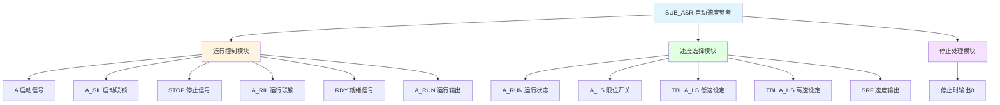

# SUB_ASR 功能块分析报告

## 基本信息

| 项目 | 内容 |
|------|------|
| 功能块名称 | SUB_ASR |
| 功能描述 | Automatic Speed Reference（自动速度参考子程序） |
| 最后修改 | 未标注 |
| 作者 | 未标注 |
| 页数 | 1页（3个程序段） |

## 功能概述

SUB_ASR是一个自动速度参考子程序，用于根据运行状态和限位开关信号自动选择速度参考值。该功能块结构简单，实现了基本的启停控制和速度选择功能。

### 应用场景
- **单速驱动控制**：控制单速电机的启停
- **双速选择控制**：根据限位开关选择低速或高速
- **简单传动控制**：用于简单的传动设备控制

### 功能特点
1. **启停控制**：实现设备的启动和停止控制
2. **速度选择**：根据限位开关选择速度档位
3. **联锁保护**：启动联锁和运行联锁保护
4. **速度输出**：输出速度参考值

## 思维导图

## 流程路径描述

### 运行控制路径：
开始 → A启动 → A_SIL联锁 → STOP检查 → A_RIL联锁 → RDY就绪 → A_RUN输出
**功能**: 控制设备的启停

### 速度选择路径：
开始 → A_RUN运行 → A_LS限位 → 选择速度 → SRF输出
**功能**: 根据限位开关选择速度

## 逐帧功能分析

### Rung 1: 运行控制

**功能描述**: 控制设备的启停

**输入条件**:
| 信号名称 | 信号描述 | 信号类型 | 触发值 |
|----------|----------|----------|--------|
| A | 启动信号 | BOOL | TRUE |
| A_SIL | 启动联锁 | BOOL | TRUE |
| STOP | 停止信号 | BOOL | FALSE |
| A_RIL | 运行联锁 | BOOL | TRUE |
| RDY | 就绪信号 | BOOL | TRUE |

**输出功能**:
| 信号名称 | 信号描述 | 信号类型 |
|----------|----------|----------|
| A_RUN | 运行输出 | BOOL |

**触发逻辑**:
- A_RUN = (A AND A_SIL AND NOT STOP AND A_RIL AND RDY) OR (A_RUN AND NOT STOP)

**功能实现**: 
启动条件串联后输出A_RUN，并通过自保持触点实现持续运行，STOP信号断开时停止。

### Rung 2: 速度选择

**功能描述**: 根据限位开关选择速度参考值

**输入条件**:
| 信号名称 | 信号描述 | 信号类型 | 触发值 |
|----------|----------|----------|--------|
| A_RUN | 运行输出 | BOOL | TRUE |
| A_LS | 限位开关 | BOOL | TRUE/FALSE |
| TBL.A_LS | 低速设定值 | REAL | 设定值 |
| TBL.A_HS | 高速设定值 | REAL | 设定值 |

**输出功能**:
| 信号名称 | 信号描述 | 信号类型 |
|----------|----------|----------|
| SRF | 速度参考值 | REAL |

**触发逻辑**:
- IF A_RUN = TRUE AND A_LS = FALSE THEN SRF = TBL.A_LS（低速）
- IF A_RUN = TRUE AND A_LS = TRUE THEN SRF = TBL.A_HS（高速）

**功能实现**: 
1. 当A_RUN为ON且A_LS为OFF时，输出低速设定值
2. 当A_RUN为ON且A_LS为ON时，输出高速设定值

### Rung 3: 停止处理

**功能描述**: 设备停止时输出零速度

**输入条件**:
| 信号名称 | 信号描述 | 信号类型 | 触发值 |
|----------|----------|----------|--------|
| A_RUN | 运行输出 | BOOL | FALSE |

**输出功能**:
| 信号名称 | 信号描述 | 信号类型 |
|----------|----------|----------|
| SRF | 速度参考值 | REAL |

**触发逻辑**:
- IF A_RUN = FALSE THEN SRF = 0.0

**功能实现**: 
当A_RUN为OFF时，使用MOVE_REAL将SRF设置为0.0。

## 触发条件总结

### 启动条件
- **A = TRUE**: 启动按钮按下
- **A_SIL = TRUE**: 启动联锁正常
- **STOP = FALSE**: 停止按钮未按下
- **A_RIL = TRUE**: 运行联锁正常
- **RDY = TRUE**: 设备就绪

### 速度选择条件
- **低速**: A_RUN = TRUE AND A_LS = FALSE
- **高速**: A_RUN = TRUE AND A_LS = TRUE
- **停止**: A_RUN = FALSE

## 实现功能总结

### 主要功能
1. **启停控制**: 实现设备的启动和停止
2. **自保持**: 启动后自动保持运行状态
3. **速度选择**: 根据限位开关选择速度档位
4. **联锁保护**: 启动联锁和运行联锁

### 速度输出逻辑
| A_RUN | A_LS | SRF输出 |
|-------|------|---------|
| FALSE | X | 0.0 |
| TRUE | FALSE | TBL.A_LS（低速） |
| TRUE | TRUE | TBL.A_HS（高速） |

## 关键信号说明

| 信号名称 | 信号描述 | 信号类型 | 用途 |
|----------|----------|----------|------|
| A | 启动信号 | BOOL | 启动控制 |
| A_SIL | 启动联锁 | BOOL | 启动条件 |
| STOP | 停止信号 | BOOL | 停止控制 |
| A_RIL | 运行联锁 | BOOL | 运行条件 |
| RDY | 就绪信号 | BOOL | 设备就绪 |
| A_RUN | 运行输出 | BOOL | 运行状态 |
| A_LS | 限位开关 | BOOL | 速度选择 |
| TBL.A_LS | 低速设定 | REAL | 低速值 |
| TBL.A_HS | 高速设定 | REAL | 高速值 |
| SRF | 速度参考 | REAL | 速度输出 |

## 调试技巧

### 调试步骤
1. 检查各联锁信号是否正常
2. 验证启停控制是否正确
3. 测试速度选择功能
4. 检查速度输出是否准确

### 常见问题
1. **无法启动**: 检查A_SIL、A_RIL、RDY信号
2. **无法停止**: 检查STOP信号
3. **速度不切换**: 检查A_LS限位开关信号
4. **速度值不对**: 检查TBL表中的设定值

### 监控信号列表
- A_RUN（运行状态）
- SRF（速度输出）
- A_SIL/A_RIL（联锁信号）
- RDY（就绪信号）
- A_LS（限位开关）
