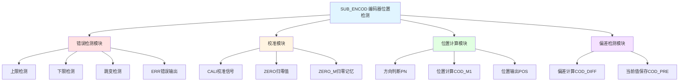

# SUB_ENCOD 功能块分析报告

## 基本信息

| 项目 | 内容 |
|------|------|
| 功能块名称 | SUB_ENCOD |
| 功能描述 | Encoder Position Detection（编码器位置检测） |
| 最后修改 | 未标注 |
| 作者 | 未标注 |
| 页数 | 1页（5个程序段） |

## 功能概述

SUB_ENCOD是一个编码器位置检测子程序，用于处理编码器信号并计算位置值。该功能块实现了编码器错误检测、校准、位置计算和偏差检测等功能。

### 应用场景
- **位置测量**：测量直线或旋转运动的位置
- **编码器接口**：处理增量式编码器信号
- **位置控制**：为位置控制系统提供位置反馈
- **长度测量**：测量材料的长度

### 功能特点
1. **错误检测**：检测编码器超限和异常跳变
2. **校准功能**：支持编码器校准归零
3. **方向处理**：处理正反向的位置计算
4. **位置输出**：输出实际位置值

## 思维导图

## 流程路径描述

### 错误检测路径：
开始 → 检测CODER上限 → 检测CODER下限 → 检测跳变 → 输出ERR
**功能**: 检测编码器是否超出有效范围或发生异常跳变

### 校准路径：
开始 → CALI信号 → 设置ZERO → 保存ZERO_M
**功能**: 执行编码器校准归零操作

### 位置计算路径：
开始 → 读取CODER → 减去ZERO_M → 方向处理 → 计算位置POS
**功能**: 计算当前位置值

## 逐帧功能分析

### Rung 1: 错误检测

**功能描述**: 检测编码器是否超出有效范围或发生异常跳变

**输入条件**:
| 信号名称 | 信号描述 | 信号类型 | 触发值 |
|----------|----------|----------|--------|
| CODER | 编码器值 | DINT | 数值 |
| UP_L | 上限值 | DINT | 设定值 |
| DN_L | 下限值 | DINT | 设定值 |
| COD_DIFF | 编码器偏差 | DINT | 数值 |
| CALI | 校准信号 | BOOL | FALSE |

**输出功能**:
| 信号名称 | 信号描述 | 信号类型 |
|----------|----------|----------|
| ERR | 错误标志 | BOOL |

**触发逻辑**:
- IF CODER > UP_L THEN ERR = TRUE（超上限）
- IF CODER < DN_L THEN ERR = TRUE（超下限）
- IF COD_DIFF > 100000 THEN ERR = TRUE（异常跳变）
- IF ERR = TRUE AND CALI = FALSE THEN ERR保持

**功能实现**: 
使用GT_DINT和LT_DINT比较器检测上下限，使用GT_DINT检测跳变值，通过OR逻辑组合输出ERR。

### Rung 2: 校准归零

**功能描述**: 执行编码器校准归零操作

**输入条件**:
| 信号名称 | 信号描述 | 信号类型 | 触发值 |
|----------|----------|----------|--------|
| CALI | 校准信号 | BOOL | TRUE |
| ZERO | 归零值 | DINT | 数值 |

**输出功能**:
| 信号名称 | 信号描述 | 信号类型 |
|----------|----------|----------|
| ZERO_M | 归零记忆值 | DINT |

**触发逻辑**:
- IF CALI = TRUE THEN ZERO_M = ZERO

**功能实现**: 
当CALI信号有效时，使用MOVE_DINT将ZERO值保存到ZERO_M。

### Rung 3: 位置计算

**功能描述**: 计算当前位置值

**输入条件**:
| 信号名称 | 信号描述 | 信号类型 | 触发值 |
|----------|----------|----------|--------|
| CODER | 编码器值 | DINT | 数值 |
| ZERO_M | 归零记忆值 | DINT | 数值 |
| PN | 方向标志 | BOOL | TRUE/FALSE |
| INC | 分辨率 | REAL | 设定值 |

**输出功能**:
| 信号名称 | 信号描述 | 信号类型 |
|----------|----------|----------|
| COD_M | 编码器偏差 | DINT |
| COD_M1 | 方向处理后值 | DINT |
| COD_R | 实数偏差 | REAL |
| POS | 位置输出 | REAL |

**触发逻辑**:
- COD_M = CODER - ZERO_M
- IF PN = TRUE THEN COD_M1 = COD_M × 1
- IF PN = FALSE THEN COD_M1 = COD_M × (-1)
- POS = COD_M1 × INC

**功能实现**: 
1. 使用SUB_DINT计算编码器偏差
2. 使用MUL_DINT进行方向处理
3. 使用DINT_TO_REAL转换为实数
4. 使用MUL_REAL乘以分辨率得到位置

### Rung 4: 偏差计算

**功能描述**: 计算编码器相邻扫描周期的偏差

**输入条件**:
| 信号名称 | 信号描述 | 信号类型 | 触发值 |
|----------|----------|----------|--------|
| CODER | 编码器值 | DINT | 数值 |
| COD_PRE | 上次编码器值 | DINT | 数值 |

**输出功能**:
| 信号名称 | 信号描述 | 信号类型 |
|----------|----------|----------|
| COD_DIFF | 编码器偏差 | DINT |

**触发逻辑**:
- COD_DIFF = CODER - COD_PRE

**功能实现**: 
使用SUB_DINT计算当前编码器值与上次值的偏差。

### Rung 5: 当前值保存

**功能描述**: 保存当前编码器值供下次使用

**输入条件**:
| 信号名称 | 信号描述 | 信号类型 | 触发值 |
|----------|----------|----------|--------|
| CODER | 编码器值 | DINT | 数值 |

**输出功能**:
| 信号名称 | 信号描述 | 信号类型 |
|----------|----------|----------|
| COD_PRE | 上次编码器值 | DINT |

**触发逻辑**:
- COD_PRE = CODER

**功能实现**: 
使用MOVE_DINT将当前编码器值保存到COD_PRE。

## 触发条件总结

### 错误检测条件
- **超上限**: CODER > UP_L
- **超下限**: CODER < DN_L
- **异常跳变**: COD_DIFF > 100000

### 校准条件
- **校准执行**: CALI = TRUE

### 位置计算条件
- **正向**: PN = TRUE，位置 = (CODER - ZERO_M) × INC
- **反向**: PN = FALSE，位置 = -(CODER - ZERO_M) × INC

## 实现功能总结

### 主要功能
1. **错误检测**: 检测编码器超限和异常跳变
2. **校准归零**: 支持编码器校准归零
3. **位置计算**: 计算当前位置值
4. **方向处理**: 支持正反向位置计算
5. **偏差检测**: 检测编码器跳变

### 计算公式
| 参数 | 公式 | 说明 |
|------|------|------|
| COD_M | CODER - ZERO_M | 编码器偏差 |
| COD_M1 | COD_M × (±1) | 方向处理 |
| POS | COD_M1 × INC | 位置输出 |
| COD_DIFF | CODER - COD_PRE | 跳变检测 |

## 关键信号说明

| 信号名称 | 信号描述 | 信号类型 | 用途 |
|----------|----------|----------|------|
| CODER | 编码器值 | DINT | 编码器输入 |
| UP_L/DN_L | 上下限 | DINT | 范围限制 |
| CALI | 校准信号 | BOOL | 校准控制 |
| ZERO | 归零值 | DINT | 校准设定值 |
| ZERO_M | 归零记忆 | DINT | 记忆归零点 |
| PN | 方向标志 | BOOL | 正反向控制 |
| INC | 分辨率 | REAL | 位置转换系数 |
| POS | 位置输出 | REAL | 当前位置 |
| ERR | 错误标志 | BOOL | 错误状态 |
| COD_DIFF | 编码器偏差 | DINT | 跳变检测 |

## 调试技巧

### 调试步骤
1. 检查CODER输入是否正常变化
2. 验证UP_L和DN_L限值设置是否合理
3. 测试校准功能是否正常
4. 检查位置输出是否准确
5. 验证错误检测功能

### 常见问题
1. **ERR常亮**: 检查编码器是否超限或跳变过大
2. **位置不准确**: 检查INC分辨率设置
3. **方向错误**: 检查PN方向标志设置
4. **校准无效**: 检查CALI信号和ZERO值

### 监控信号列表
- CODER（编码器值）
- POS（位置输出）
- ERR（错误标志）
- COD_DIFF（编码器偏差）
- ZERO_M（归零记忆值）
